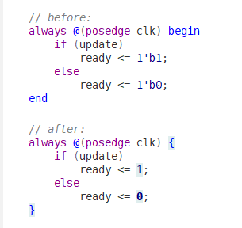

# `easy-verilog`

easy-verilog - Emacs Minor mode for Verilog-mode http://www.veripool.org/wiki/verilog-mode



`easy-verilog-minor-mode` uses for improve readability of Verilog. The main function is replace words "begin" and "end" to symbol "{" and "}".

## Setup

1. Download [this file](https://raw.githubusercontent.com/yuravg/easy-verilog/master/easy-verilog.el)

2. Add this to your .emacs:

```elisp
(load-file "PATH-TO-THE-FILE-YOU-JUST-DOWNLOADED")
(add-hook 'verilog-mode-hook #'easy-verilog-minor-mode)
```

or

```elisp
(use-package easy-verilog
  :load-path "PATH-TO-THE-FILE-YOU-JUST-DOWNLOADED"
  :config
  (progn
    (add-hook 'verilog-mode-hook #'easy-verilog-minor-mode))
```

* Adjust of `easy-verilog-face`:

```elisp
(set-face-attribute 'easy-verilog-face nil :weight 'bold :foreground "Blue")
```

## Thanks

Clément Pit--Claudel for his https://github.com/cpitclaudel/easy-escape
